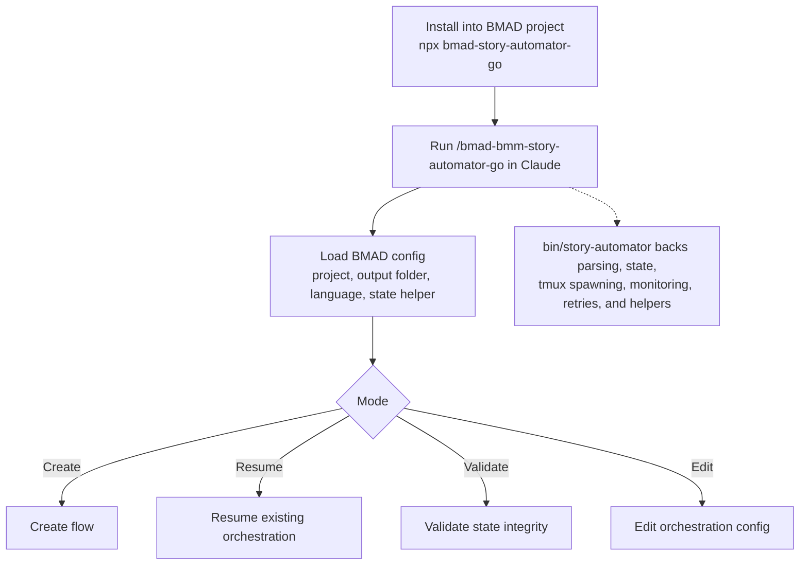
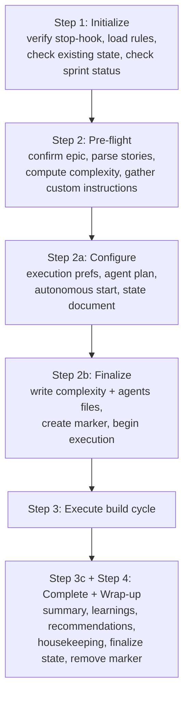
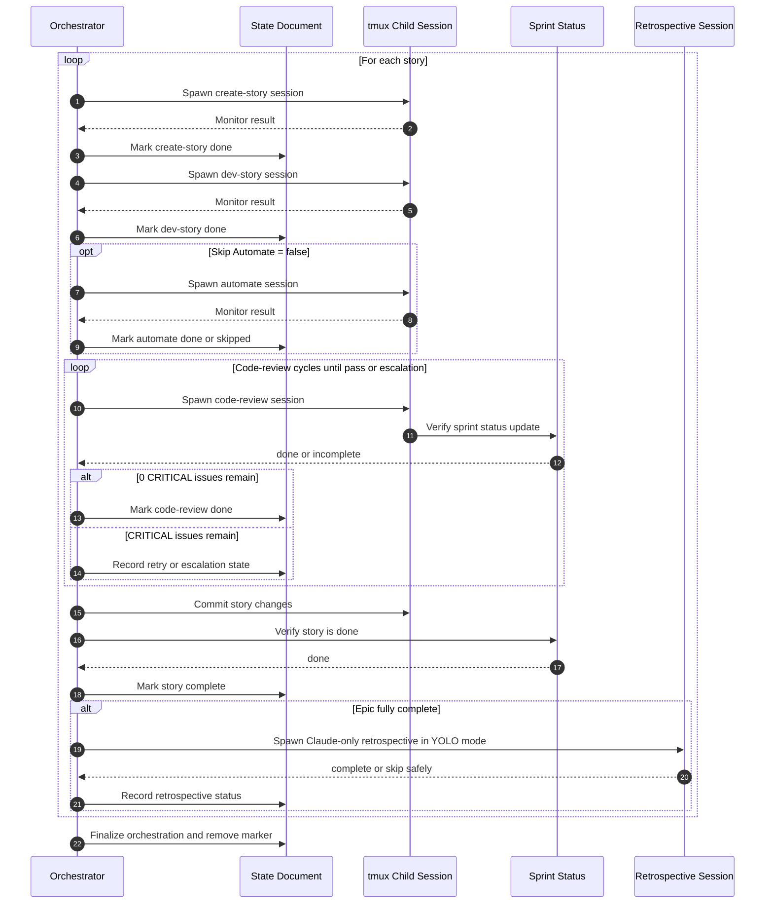
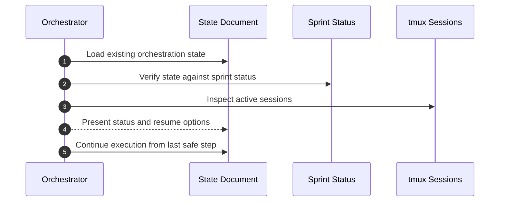
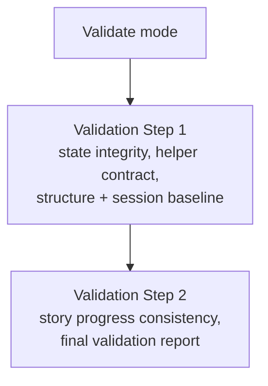
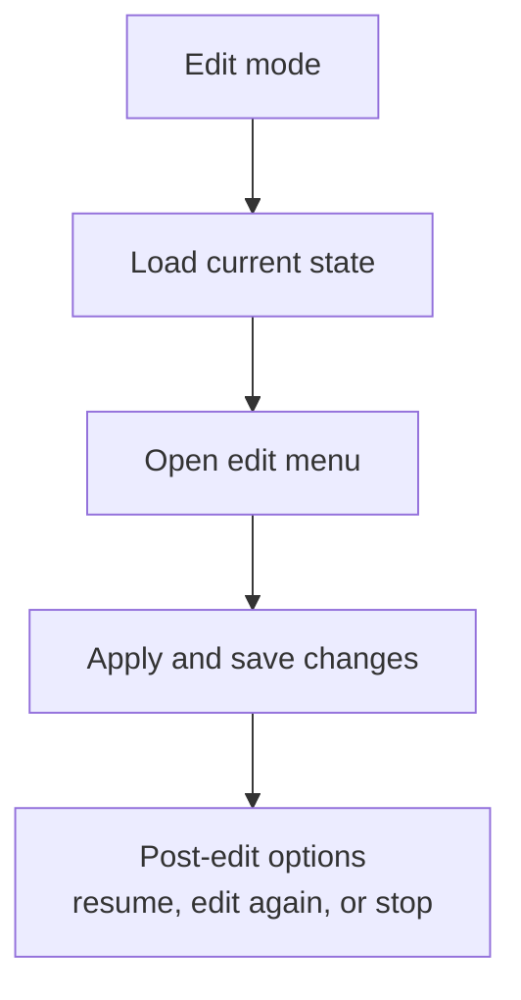

# Story Automator Go


> Use this to wake up to this.

Portable bundle with source for BMAD `story-automator-go`. If you do not know what [BMaD](https://github.com/bmad-code-org/BMAD-METHOD) is, you're here to early. Go read their docs, use it for a project or two and come back when you want to try automating the story-loop.

This should be run after the planning phase has finished(After all planning phases, and after running /bmad-bmm-sprint-planning)

## Quickstart

Install with `npx`:

```bash
cd /absolute/path/to/your-bmad-project
npx bmad-story-automator-go
```

Then run:

```bash
claude --dangerously-skip-permissions
# inside claude
/bmad-bmm-story-automator-go
```

Or run from anywhere and pass the target project explicitly:

```bash
npx bmad-story-automator-go /absolute/path/to/your-bmad-project
```

## Recommendations / expectations / rants
- This is not a genie, as always, the worse your planning artifacts are, the worse your results will be. I strongly recommend to NOT automate the first epic which is usually project bootstrapping. Start automating after project foundation is sound and you've verified that the agent hasn't sneaked in or ignored random requirements.
- If you're low on usage, the automator runs quite consistently using sonnet, though recently Claude Code has increased usage so much I simply use Opus for the automator as well.
- Do not expect this to create bug-free code. The project always has issues after running this, but it does make progress much more easier. After running a full session spanning multiple epics, simply try running the project yourself and do an interactive session addressing issues if they exist. Additionaly, create a file full of feedback, feed it to `create-epics-and-stories` and then run the automator again if you're not bothered to do the interactive mode either.
- Recommend to skip tests for the first epic(IF you ignored my first point and decide to automate epic 1 as well). 
- You can be VERY specific during agent customisation and Claude will generate the agents file for you pretty much consistenly. If you want to change things mid-automation, update the agents orchestration file in `_bmad-output/story-automator/agents/`. This will work mid-automation so simply edit and save. The file should be intuitive enough, just don't break the agent structure and don't try to use anything other than claude / codex / false.
- If you want to start a claude session in the same directory as one that has the story-automator running, run with `export STORY_AUTOMATOR_CHILD=true` to ignore the stop-hook.
- Complexity estimates are shite. But there's no silver bullet for this imo since it's just a script reading through the ACs and looking for keywords. Open to suggestions on how to make it better.
<details>
<summary>The rants</summary>
    <ul>
        <li>
            Run and wake up full of excitement. I had to go through 6 nights to wake up in excitement only to get my hopes and dreams crushed to an automator that stopped after 1~2 hours. You don't need to do that and I envy you.
        </li>
        <li>
            It's called `story-automator-go` because there were 2 versions before this, way back when v6 was in alpha, `story-automator` and `story-automator-program`. Both were bash scripts and too many MD files taped together with blood, sweat, tears and shotgunning at 5am. If there's anything I learnt from trying to get this to the current state is, agents + deterministic outputs and instructions and minimal context is fucking awesome. You should try it for your own agent orchestrator / swarm. Maybe I'll share that as well someday. But BMB is also awesome so you might not need it. Step files are GOAT.
        </li>
    </ul>
</details>

## What This Is

This repo packages the installable workflow payload plus the Go program source for `story-automator-go` so another BMAD project can install it cleanly and still inspect or rebuild the binary if needed.

This bundle supports:
- Claude
- Codex

This bundle does not support:
- other agent CLIs

Important:
- retrospective child runs are Claude-only even if the main orchestration uses Codex elsewhere

## How It Works

### 1. Entry + mode routing



### 2. Create flow



### 3. Story execution loop



### 4. Resume, validate, edit







The practical shape is:
- one orchestrator session
- one state document
- many short-lived tmux child sessions for `create-story`, `dev-story`, `automate`, `code-review`, and `retrospective`
- deterministic retry + escalation around failures
- `done` gated by the bundled `code-review` workflow

## What Gets Installed

The installer copies bundled payload into the target project:
- `_bmad/bmm/workflows/4-implementation/story-automator-go`
- `_bmad/bmm/workflows/4-implementation/code-review`

It also:
- installs the correct platform binary as `bin/story-automator`
- installs the Claude command `bmad-bmm-story-automator-go`
- creates missing Claude dependency commands for `create-story`, `dev-story`, `code-review`, `retrospective`
- creates `bmad-tea-testarch-automate` only if a compatible automate workflow already exists in the target project

## Why Code Review Is Bundled

`story-automator-go` now depends on the updated `code-review` workflow state gate.

Critical rule:
- a story should move to `done` only when **zero CRITICAL issues remain after fixes**

Because of that, this package installs the bundled `code-review` workflow alongside `story-automator-go`. If the target project keeps an older review workflow, the automator can incorrectly move stories to `done`.

## Requirements

Host requirements:
- `tmux`
- Claude Code
- macOS or Linux
- `amd64` or `arm64`

If the automate workflow is missing, install still succeeds. In that case run `story-automator-go` with `Skip Automate = true`.

## How To Use It

### Claude

After install:

```text
/bmad-bmm-story-automator-go
```

### Codex

Do not run the orchestrator using Codex. I have never tried it because Codex does not support hooks which is vital for continuation.

## How To Verify A Target Install

Manual checks inside a target project:

```bash
cd /path/to/project
_bmad/bmm/workflows/4-implementation/story-automator-go/scripts/derive-project-slug.sh
grep -n "0 CRITICAL issues remain after fixes" _bmad/bmm/workflows/4-implementation/code-review/instructions.xml
```

Expected:
- JSON containing `"ok": true`
- a matching `CRITICAL issues remain` line in `code-review/instructions.xml`

## Package Layout

Payload copied into target projects:
- `payload/_bmad/bmm/workflows/4-implementation/story-automator-go/`
- `payload/_bmad/bmm/workflows/4-implementation/code-review/`

Packaged binaries:
- `artifacts/story-automator/bin/darwin-arm64/story-automator`
- `artifacts/story-automator/bin/darwin-amd64/story-automator`
- `artifacts/story-automator/bin/linux-arm64/story-automator`
- `artifacts/story-automator/bin/linux-amd64/story-automator`

Package scripts:
- `install.sh`
- `bin/bmad-story-automator-go`
- `package.json`

Bundled program source:
- `source/go.mod`
- `source/cmd/story-automator/`

## Publish To npm

The repo is now wired for npm distribution.

Publish steps:
- `npm adduser`
- `npm publish`

After publish, install into any BMAD project with:

```bash
cd /absolute/path/to/your-bmad-project
npx bmad-story-automator-go
```
